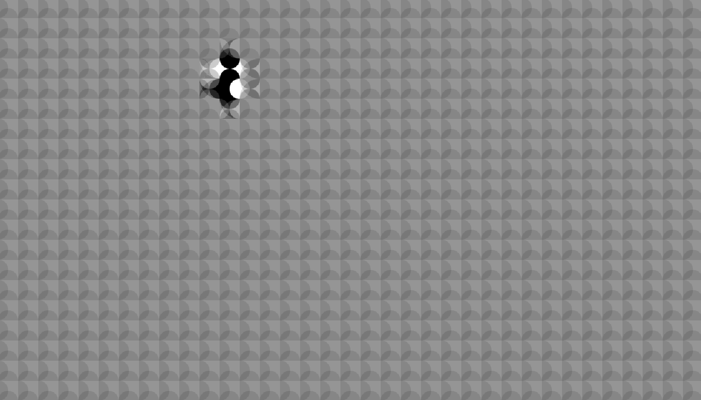
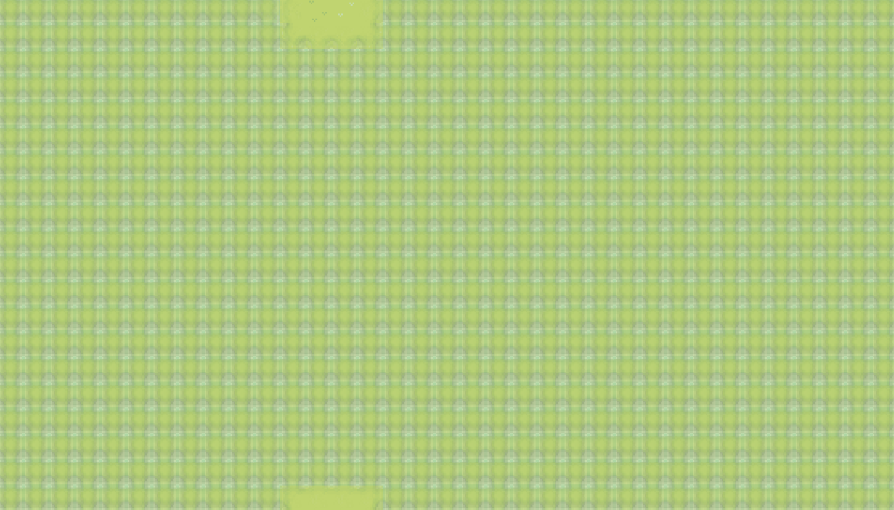
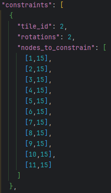

# 2D Wave Function Collapse Visualizer
Generates an image using a 2D grid of tiles. Utilizes the wave function collapse 
algorithm in two dimensions. The image is generated "randomly" and will be novel and unique.

Here are some examples:
#### Circles tile set, no constraints, default tile weights

#### Grass Tiles tile set, no constraints, heavily weighted for landlocked or water tiles

# Installation
Simply clone the repository and install the requirements listed below in `technologies used and requirements`.

### Technologies Used and Requirements
This project uses mostly core python, except for `PyGame` which
is used for the frontend display. 
Pygame can be installed via `pip install pygame`

# Basic Usage
To use it without any modifications, simply run `pygame_frontend.py` or `solver.py`.
- `pygame_frontend.py` is the implementation of the visualizer and the intended way to run the program.
- `solver.py` runs without updating any images and only generates CLI information about the grid. This is the "backend class"
If you want to change any settings (tile set, constraints, weights, etc) see the below section `Advanced Usage`

# Algorithm
This is an explanation of my implementation of the wave function collapse algorithm.
1. Create tile prototypes 
   1. Read `settings.ini` and the `base_tiles` `JSON` to create the tile prototypes.
2. Set up the grid 
   1. For each tile, we perform any permutations (rotations) to create our `all_tiles` tile set.
   2. Initialize a node for each position on the grid
      1. Before we can set up the nodes, we set each tile's possible neighbors based on their sockets.
      2. Each node starts with every tile option as a possibility, so the `tile_options` are set to `all_tiles` at this stage
   3. Apply any constraints to the grid
3. Setup the pygame visuals.
   1. Each node on the grid is associated with a `NodeSprite` object on the frontend. 
When a node is updated, the corresponding `NodeSprite` is visually updated.
4. While the solution is not yet solved...
   1. Find the list of nodes with the least amount of tile options and randomly choose one node.
   2. Collapse this node
      1. Choose a random tile from the tile options and set the node's tile to this tile.
      2. Propagate this choice
         1. For each neighbor to the node, limit the remaining choices based on the tile we just chose.
         2. For each of those neighbors *which were updated in the last step*, propagate.
         3. Any node that is updated in this step is flagged so that the visualizer will be updated as well.
   3. Draw the new board state
   4. If we find a failure during this while loop, we detect it and perform the corresponding fail step to reset the state.
      1. if "RESET" -> go back to step 2. 
      2. if "RESET_FROM_FAIL" -> first set the node we found a contradiction, then go to step 2
5. Once the solution has been found, do nothing.

# Tilesets
The package comes with a few tilesets. They are found in `base_tiles`.
Within each set contains the images and a `JSON` file containing a set of rules.
The program parses the `JSON` and expects the images referenced within the rules to be
in the same folder. 
#### Tile Attributes
- id: unique identifier
- sides: the rules details in `tile rules` for each side
- weight: how frequently this tile will be chosen compared to other tiles.
  - if weight is not declared on a tile, it defaults to 1
- image_path: the file name, assumed to be within the same folder as this `JSON` file
- number_of_rotations: number representing the number of different tiles to create from this tile. 
  - use any non-negative integer, but it will only rotate 0, 1, 2, 3 times and at most create 4 unique permutations.

### Tile Rules
To set up the rules for a tile, we utilize a socket system wherein each side of a
tile is represented by a string. Two tiles can be next to each other if their corresponding
sides' strings are *reverse of each other.*
- Example: 
  - Tile A's "up" side has a socket "1234a"
  - Tile B's "down" side has a socket "bdf"
  - Tile C's "down" side has a socket "a4321"
  - We place Tile A on the board. We check to see if Tile B can go above Tile A and so
compare Tile A's "up" and tile B's "down". However "1234a" != "fdb" (reverse of Tile B) so they cannot be neighbors.
  - We now check if Tile C can go above Tile A, and indeed "1234a" == "1234a" (reverse of Tile C)

## Constraints
A constraint can be defined as a set of extra rules imposed on the grid. The current implementation
is such that a constraint sets a specific node on the grid to a specific tile. 
Constraints are read into the program via the tile set's `JSON` under the `constraints` section as a list
of tile_id and rotation combinations, with a field defining which nodes that tile affects.

## Weights
Each tile read in from the tile set `JSON` has a weight associated with it (defaulting to 1 if no weight specified).
This weight is taken into account when choosing the next tile to collapse.
When a node is chosen to collapse (as detailed by the `algorithm` section), the set of tile options remaining is grabbed.
The program then randomly chooses which tile option to select for the node. 
*The weight of the tile determines the likelihood it will be chosen at this stage*.
- Example: We have 3 tiles: A, B, C. A and B have weight = 1, but C has weight = 998.
- We collapse a node and it's options are A, B, C
- When we randomly choose between A, B, C, the likelihood is as follows:
  - A has a 1/1000 chance
  - B has a 1/1000 chance
  - C has a 998/1000 chance

By changing the weights, the pattern can be influenced to favor certain tiles.
This is useful if you would like to have more islands in a tileset with water/land, have more
black in a black/white tileset, etc.

## Failures / Contradictions
It is very common in certain tilesets for the wave collapse sequence to arrive at a contradiction.
This is when there is a tile which has *0 valid remaining moves*. Thus, the sequence is invalid and the
image cannot complete as is.
There are some ways to deal with this happening. 
The options for my program can be adjusted using the `FAIL_CONDITION` setting in settings.ini
- "END" - end the program and print to command line.
- "RESET" - reset the board and try again at a random cell.
- "RESET_FROM_FAIL" - reset the board to default and rerun, starting from the failed cell.

# Advanced Usage
### Changing the tileset
Go to the `settings.ini` file in the root directory and change `TILE_SET_NAME` to one of the folder names
in "base_tiles". 

### Changing a tileset rule
Within `base_tiles/{the set you are using}`, open the `JSON` ruleset. 
Each object in the `tile_set` section represents a tile. 

### Creating your own tileset
If you wish to create your own tileset, you must do the following:
- Create a new folder under base_tiles with the name of your set.
  - This folder must include `png` images and a `json` with the tile rules. Use one of the 
other tilesets as a guideline and reference "tile rules" for creating socket rules
- Change the `TILE_SET_NAME` field in `settings.ini` to the tileset name you chose.

It is a good idea to draw out your tileset when creating your sockets so as not to make mistakes
when outlining it in the JSON file.
